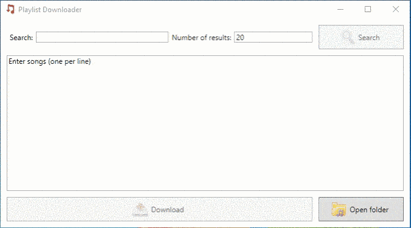
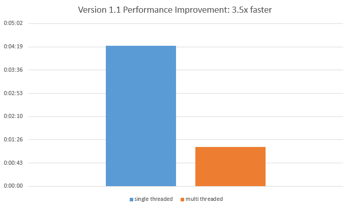

PlaylistDownloader 1.9
======================

Download your whole playlist with one click of a button

Features
========

* Download songs by entering the songname or songname and artist
* Download a song by entering a youtube url
* Search for songs using the build it search
* Songs volume is normalized after downloading. Ideal for burning multiple songs to a cd and have the volume be consistent
* Songs are downloaded in parallel. Number of parallel downloads depends on the number of cpu cores.
* Songs are saved under: c:\users\username\Music\playlistdownloader 

Development
===========

This program is written using visual studio 2017

To run the test project you need this extension:
https://marketplace.visualstudio.com/items?itemName=NUnitDevelopers.NUnit3TestAdapter

Then use the "Test Explorer" window to run the tests

ChangeLog
=========

##Version 1.3 and up

https://github.com/bertyhell/PlaylistDownloader/releases

##Version 1.2

- More finegrained progress for download and conversion process
- Correctly aborts processes when user clicks abort
- Added "open download folder" button
- Double click on song to start playing
- Added percentage to every playlist item
- added auto updater

##Version 1.1

- Made Download and convert process multi threaded
- Speed increasement of 3.5 times.

